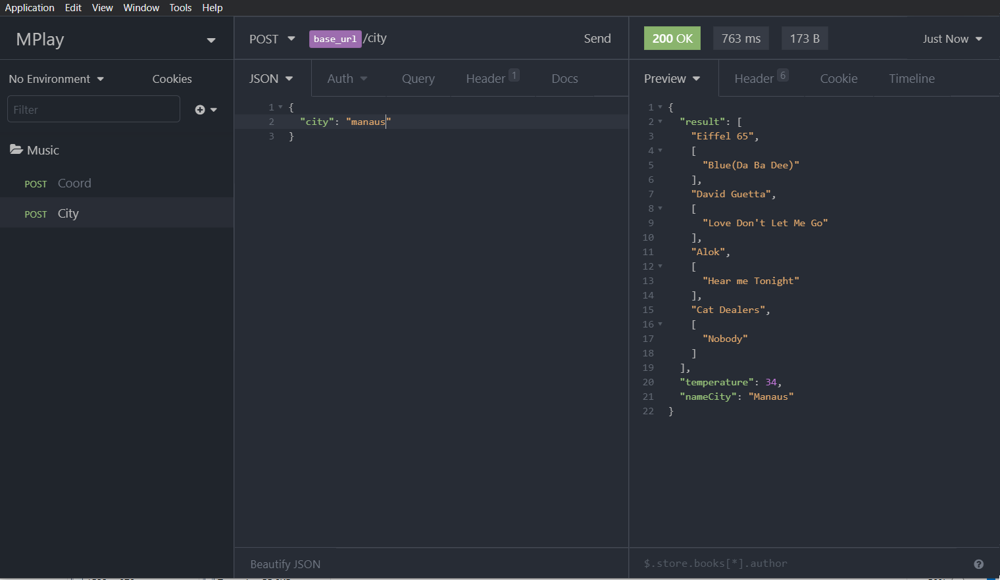
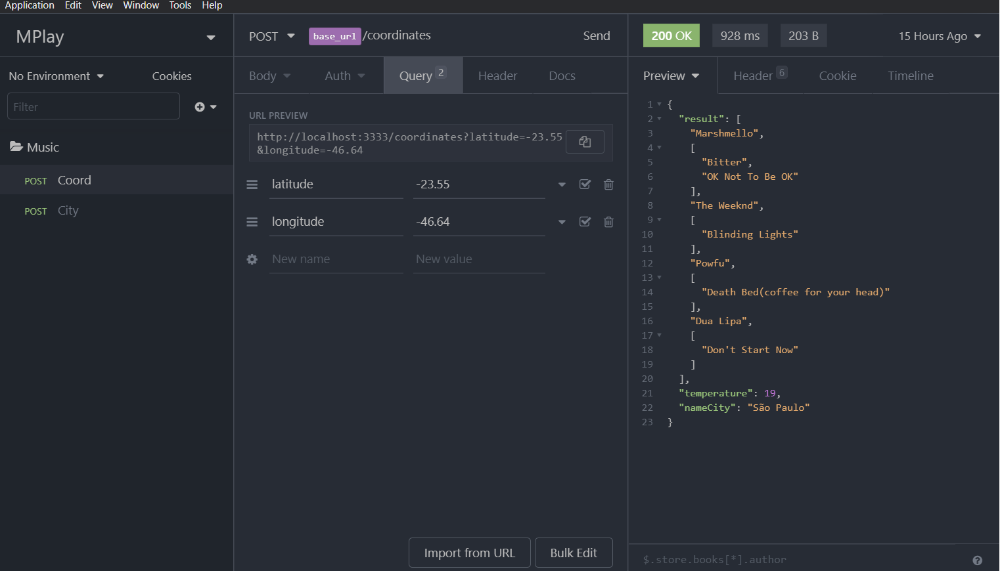

<h1 align="center">
  
</h1>

<h6 align="center">Big Bang - Desafio Backend</h6>

<h5 align="center">Criar um micro-serviço que receba requisições HTTP no formato REST que receba como parâmetro o nome de uma cidade ou uma combinação de latitude e longitude e retorne uma sugestão de playlist (array com o título das músicas) de acordo com a temperatura atual da cidade.</h5>

# Ferramentas usadas
 * [Node.js](https://nodejs.org/en/)
 * [Insomnia](https://insomnia.rest/download/)
 * [OpenWeatherMaps](https://openweathermap.org/current)
 * Typescript

# Como rodar
```
# Clone do repositório
Faça o clone da aplicação
$ git clone https://github.com/FilipeDiasLima/MPlay.git
```
## Rodando o server/API

```
# Navegue até a pasta server
$ cd Mplay/server

# Instale as dependencias
$ yarn

# Execute o comando
$ yarn dev:server
```
- Foi usada a API da OpenWeatherMaps;
- Dentro dos arquivos há um arquivo JSON do Insomnia, ferramenta utilizada para fazer as requisições. Importe para dentro do aplicativo.
- Há duas request para serem feitas

**City**, onde o usuário entra com o nome da cidade no **body json**:



E a **Coord**, onde o usuário entra com as coordenadas dele nos **query params**, as coordenadas foram postas nos querys, pois num front-end poderia usar-se a geolocalização do usuário para as funcionalidades do app, sendo assim automática:


